# Pico GG LCD

Work-in-progress update to Trirosmos' original RP2040 Game Gear mod.

More details on the [SMSPower Forum Thread](https://www.smspower.org/forums/20164-OpenSourceGameGearScreenReplacementPicoGGLCD)

## Status

Alpha. Main features have been proof-of-concepted, and a working prototype built based on the WL355608 branch (with minimal bodge-fixes). 
The firmware supports both Game Gear and Master System mode, but no adjustable scaling options yet.

> [!NOTE]
> The PCB design is likely to see major changes. The current build includes unneccessary placeholder components to be removed. The [WL355608-Dev](tree/WL355608_dev) branch will be updated with Beta changes first.


## "Working" Features

- 640x480 "HD" 3.5inch LCD WL-355608
- HDMI video output with stereo audio using [ikjordan PicoDVI branch](https://github.com/ikjordan/picodvi)
- LED Brightness control with Brightness Wheel
- On-Screen menu. For menu items. And other things.
- GG Mode at 4x horizontal 3x vertical scaling
- SMS mode at 2x scaling
- [Installation Ribbon](#installation-ribbon)
- 3d printable screen holder

### Demo Video Link:

[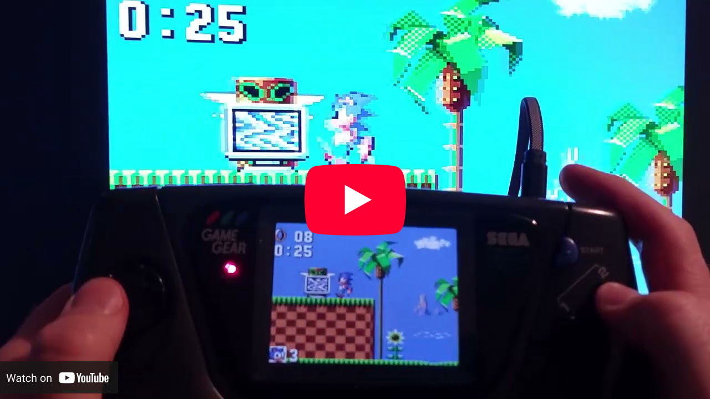](https://www.youtube.com/watch?v=du8Fr7flVrw)

### PCB (Alpha Prototype 4)

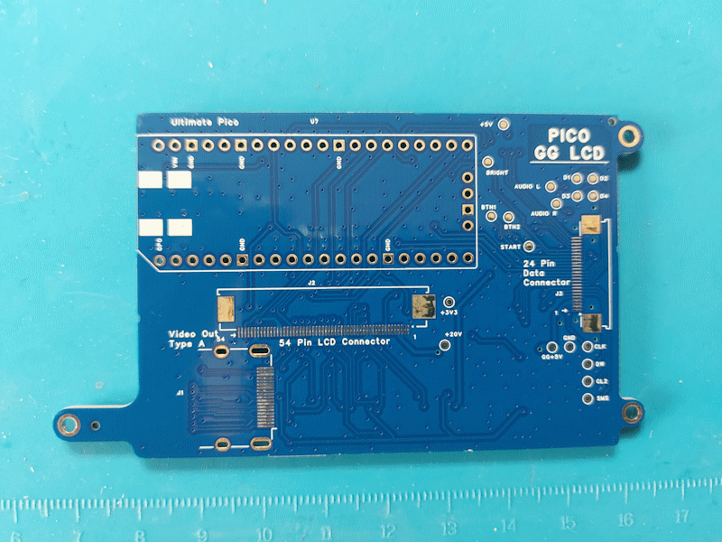 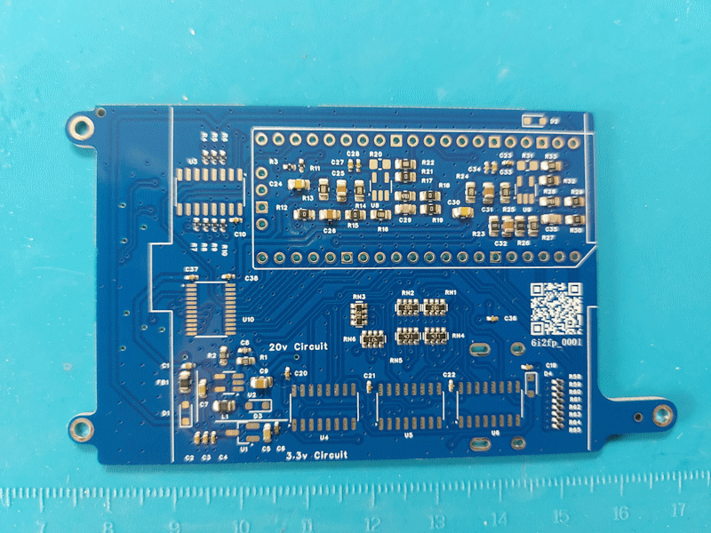

## Issues/Upcoming Changes/ToDo

- The LCD connector ribbon is likely to be rotated 180 degrees, will make soldering easier for both LCD and HDMI connectors.
- The op-amps used for audio capture will probably be changed for a dual-op-amp instead of two singles.
- Audio has lots of interference, could be from the LCD mod, could be from the GG.
- The XC6206 3.3v regulator was used to try and eliminate noise from the Pico's onboard regulator interferring with ADC, but might be unneccessary now.
- Remove placeholder components in the audio circuit.
- Corrected LED backlight dimming circuit - currently uses 2 GPIO pins, plus a bodge as shown below.
- The GG Clock pin is no longer needed.
- HDMI Hot-Plug-Detect implemented with the spare Pico GPIO pin.
- Installation Ribbon needs updating to remove the GG Clock pin. 
- Memory. Firmware currently uses 2 framebuffers to help prevent tearing, but with all the other features the Pico is starting to stretch its 264KB RAM... rotating the LCD connector so the LCD is mounted up-right might help allow a single framebuffer and recover some memory for other features.
- The shift registers probably have more performance in them, might be able to work with 2 instead of 3 - might not be worth finding out?


### RP2040 vs RP2350B

Instead of using serial->parallel shift registers to implement the LCD RGB444 input, we could use the extra pins of the Pico2 48-GPIO RP2350B. These are more expensive even after excluding the cost of the 3x 74HC595 shift registers needed for the RP2040, but would simplify the PCB a lot... It was fun to make the project work on an RP2040!

Plus the extra ram of the RP2350 (520KB vs 264KB) will help allow other features to be added to the firmware.


## How It Works

The Game Gear outputs serial RGB444, which is captured using PIO programs and stored in a 16-Bit framebuffer. 
- GG video capture uses 7 GPIO pins: 4 data + 3 control. (*6 without GG Clock now, but anyway)
- PicoDVI output uses 8 GPIO pins.
- LED Backlight brightness control uses 2 GPIO pins.
- LCD requires 3 control signals, Reset, Clock and Data-Enable.

This is 20 pins for capture, HDMI output and LCD control, leaving **10** pins from the 30 GPIO Ultimate Pico.

The LCD expects parallel RGB for 640x480 60Hz. For RGB444 the lcd needs **12** input lines.

To feed the LCD with 12 data inputs, we can use serial-to-parallel shift registers to read data from the Pico serially over a few pins, and send to the LCD over 12 parallel pins.

Although the shift registers have their own timing limits, by using a combination of multiple registers and reusing the same data (scale the image horizontally by clocking the LCD up to 4 times) we can reduce the load on the individual register.

The outputs from the shift registers are interleaved to the LCD to avoid requiring any bit-shifting from the frame buffer.

So the Pico outputs 160 pixels of 12 bit data, with 4 bits per shift register clock to 3 shift registers, and then clocks the LCD 4x for an effective 640 pixels.
Using 7 GPIO pins: 3 MOSI, 1 shift register Latch, 1 shift register clock.

Which leaves a few GPIO pins for audio capture!

### Shift Register Diagram

Hopefully this diagram helps visually explain how the shift registers are wired in:

 


## Build Pics

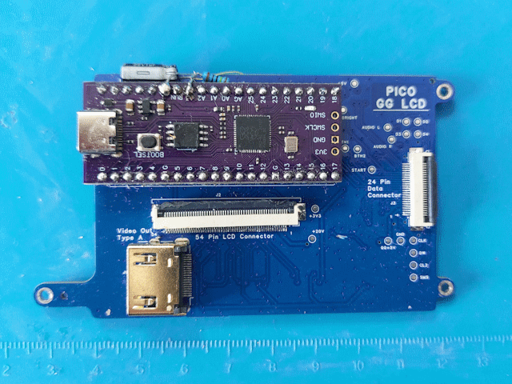 
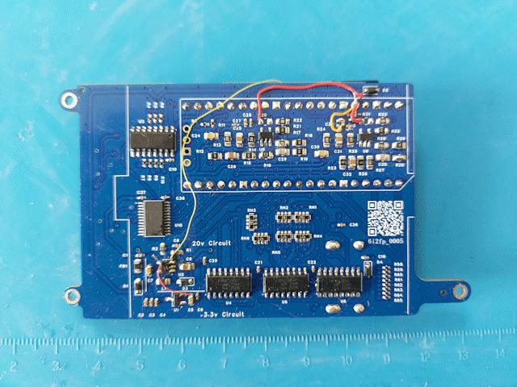 
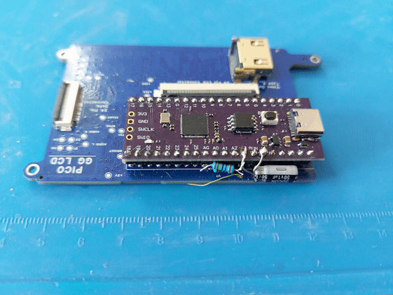

### Assembled PCB

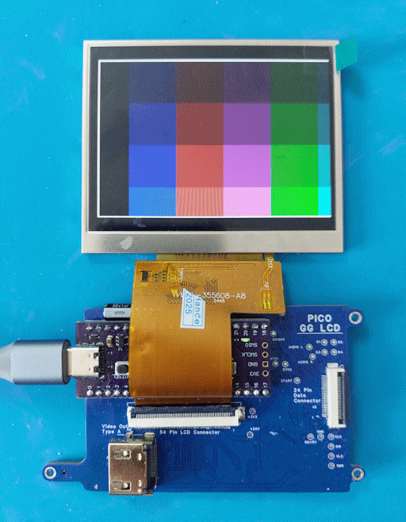

### Main Board Installed

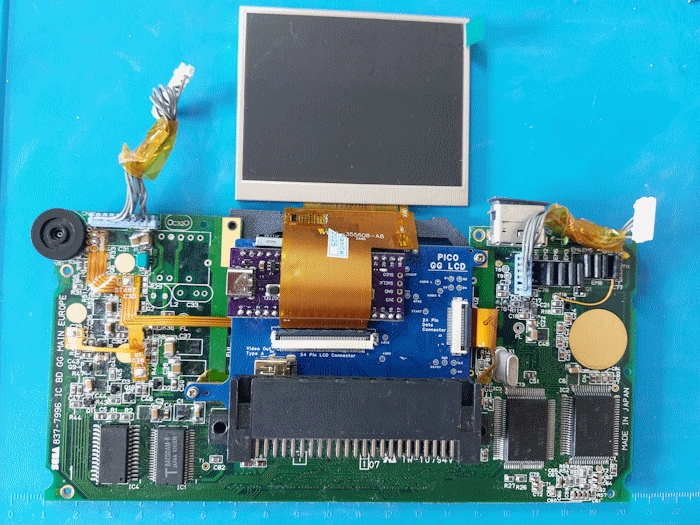

### Main Board Testing

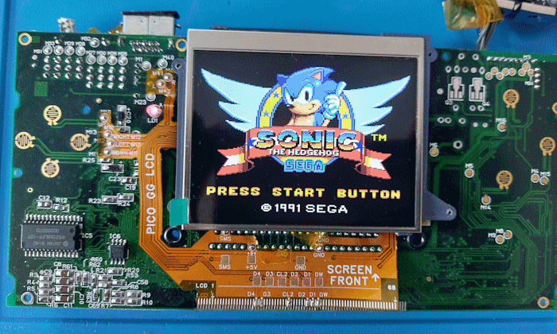

### Awaiting Closure

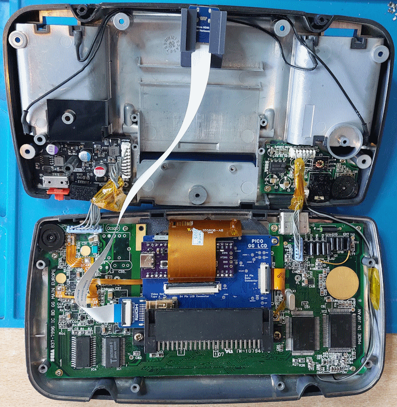

### Completed Build

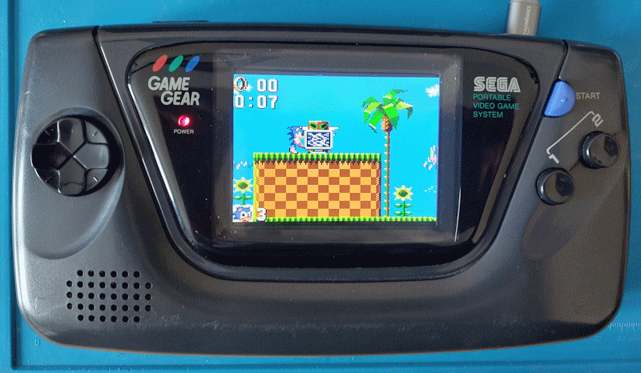


## Installation Ribbon

There is an FPC Installation Ribbon project for easy soldering to the game gear main board. This is designed for the arms to be folded out to reach the various solder points.

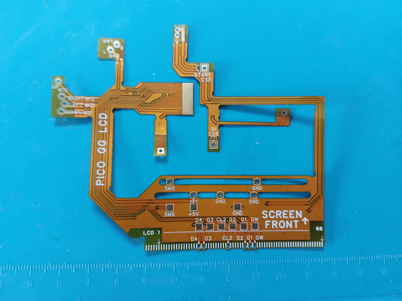

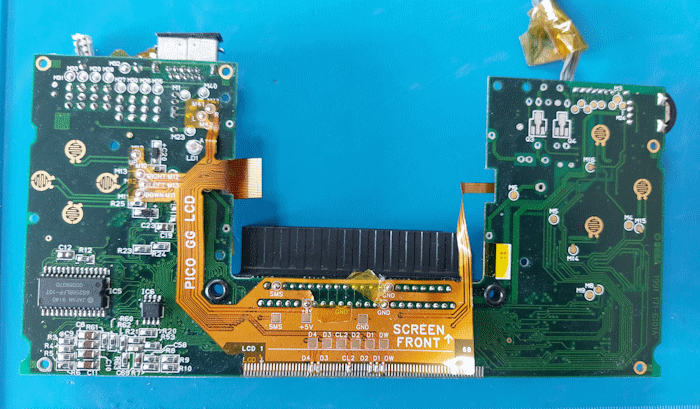

## Schematic

Schematic PDF: [hw/GG_LCD_DIY.pdf](hw/GG_LCD_DIY.pdf)

## Gerbers/Bom

Main PCB Gerbers & Bom: [hw\jlcpcb\production_files](hw\jlcpcb\production_files)

Installation Ribbon Gerbers & Bom: [hw\InstallationRibbon\jlcpcb\production_files](hw\InstallationRibbon\jlcpcb\production_files)

Full details in the above files and KiCad project, but here's some of the highlights:

| Component | Description | Quantity |  Example Link(s) | 
| --- | --- | --- | --- |
| Pico GG LCD PCB | Printed Circuit Board | x1 |  |
| WL-355608 | 640x480 3.5" LCD<br />(Also sold as "RG35XX Replacement Screen") | x1 | https://www.aliexpress.com/item/1005005669918579.html <br /> https://www.aliexpress.com/item/1005007035513918.html |
| 30-GPIO Ultimate Pico | Purple RP2040 | x1 | https://www.aliexpress.com/item/1005005594351599.html <br /> https://www.aliexpress.com/item/1005007057526637.html |
| 54-Pin FPC Connector | LCD Ribbon Connector - Flip/Drawer "Bottom" | x1 | https://www.aliexpress.com/item/1005006818638048.html <br /> https://www.aliexpress.com/item/1005008569249941.html |
| 24-Pin FPC Connector | Data Connector - Flip/Drawer "Bottom" | x1 | https://www.aliexpress.com/item/1005006818638048.html <br /> https://www.aliexpress.com/item/1005008569249941.html |
| XC6206P332MR-G | 3.3v Regulator | x1 | https://www.aliexpress.com/item/33025330295.html |
| TPS61040DBVR | 20v Regulator | x1 | https://www.aliexpress.com/item/1005007852981529.html |
| [74HC595D](docs/sn74hc595.pdf) | Serial->Parallel Shift Register | x3 | https://www.aliexpress.com/item/1005009410525894.html |
| [74HC165D](docs/sn74hc165.pdf) | Parallel->Serial Shift Register | x1 | https://www.aliexpress.com/item/1005009410525894.html |
| [SN74LVC4245APWR](docs/sn74lvc4245a.pdf) | Level-Shifting Transceiver | x1 | https://www.aliexpress.com/item/1005009206069625.html <br /> https://www.aliexpress.com/item/1005011552818805.html |
| [LMV321IDBVR](docs/lmv321.pdf) | Single Op-Amp | x2 | https://www.aliexpress.com/item/1005006127706764.html |
| HDMI Connector |  | x1 Optional | https://www.aliexpress.com/item/1005001412266648.html |
| DIY HDMI Cable | (See note below) | x1 Optional | https://www.aliexpress.com/item/1005004318851140.html <br /> https://www.aliexpress.com/item/1005006437300837.html |
| 20pin 0.5mm FFC | Cable for HDMI connectors | x1 Optional | https://www.aliexpress.com/item/1005007561337665.html |

Plus inductor, ferrite bead, diodes, capacitors, resistors, resistor network/arrays.

### DIY HDMI Cable Note

> [!WARNING]
> For DIY HDMI Cable, you need to buy **both Male and Female connector ends from the same listing** to ensure compatability with each other. 

Multiple listings included just as examples. If you mix-and-match across listings you might find the connector boards have different pinouts.

The cable requires a Type-A1 Male connector (the standard type) to connect to the PCB, plus a Female receptacle connector to be mounted inside the case, such as the Standard Type-A (often A4), or Micro-HDMI (often D4), or Mini-HDMI (Often C4) plus a 20cm FFC ribbon to join them together. (15cm is probably ok too)

The Micro-HDMI female connector is ideal for the minimising the size of the hole in the case, but still requires an appropriate Micro-HDMI cable or adapter to connect to a TV.

### DIY HDMI Examples 


### Micro-HDMI Shell Hole

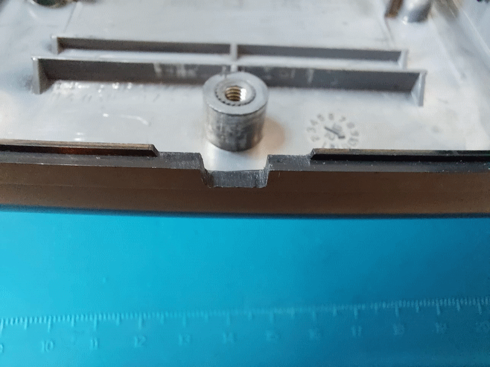

### Micro-HDMI Connector Mounted

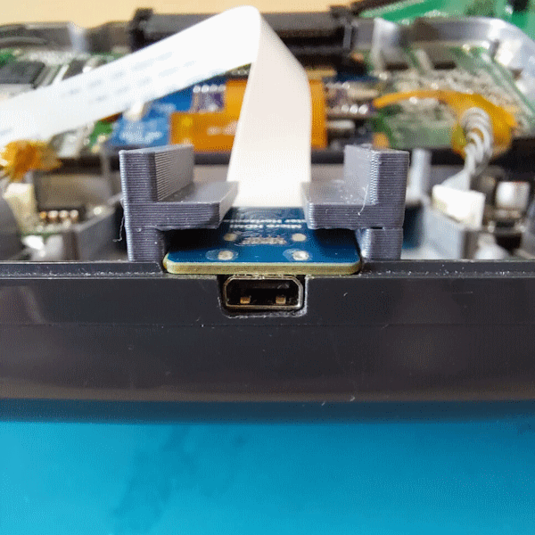

### Complete Micro-HDMI Install

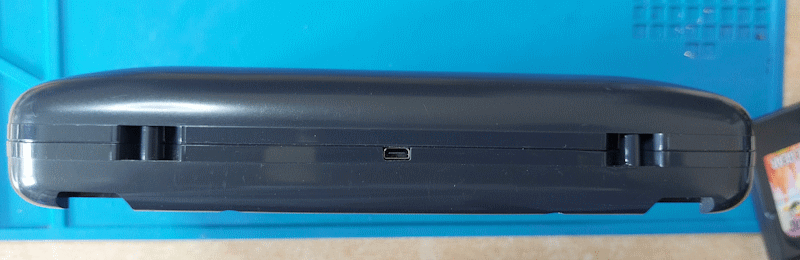

### Don't Do This! Careful how the ribbon folds within the case!

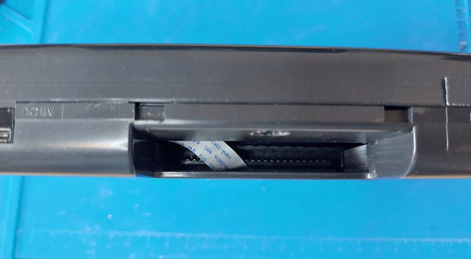


# <br/><br/><br/>
### Original project readme for reference. This branch builds upon the fundamentals below:
<br/><br/>
# Pico GG LCD


RP2040-based Game Gear screen replacement kit.
Even a cheapo modern LCD has much, much, much better contrast ratio than the OG screen.

## Building the software

Clone this repository and pull all submodules:
```Bash
git clone https://github.com/Trirosmos/pico_gg_lcd
cd pico_gg_lcd
git submodule update --init --recursive
```

Then, run `sw/build.sh`:

```Bash
cd sw
mkdir build
cd build
cmake ../CMakeLists.txt
make
```

This should generate an uf2 file you can upload to the RP2040;

## Building the hardware

Componentes you'll need and their approximate cost:

- Pico GG LCD PCB ($5)
- [PMOD HDMI adapter board](https://aliexpress.com/w/wholesale-pmod%2525252dhdmi.html?spm=a2g0o.detail.search.0) ($4) 
- [54-pin FPC connector adapter board](https://aliexpress.com/item/32827105259.html) ($2)
- [LQ035NC111 LCD module](https://aliexpress.com/w/wholesale-LQ035NC111.html?spm=a2g0o.home.search.0) ($10)
- [RP2040 board that exposes all 30 GPIOs](https://aliexpress.com/item/1005003796653297.html) ($4)
- BS170 or similar NMOSFET ($0.3)
- ~470uH axial THT inductor ($0.2)
- 2x SOD-123 Schottky diode ($0.4)
- 10k 0805 resistor ($0.05)
- 100k 0805 resistor ($0.05)
- 100nF 0805 resistor ($0.05)
- 100uF 0805 resistor ($0.05)
- 22uF 0805 resistor ($0.05)

Total approximate BOM cost: $26

First assemble passive components and transistor, then the RP2040 board and leave the FPC connector to be connected last.
The final board should look something like this, sans the bodge wire:


## How Game Gear video signals work

The Game Gear ASIC generates digital video signals that the LCD drivers in the LCD ribbon use to drive the actual display segments.

In NTSC mode, i.e, when test pad T10 is connected to +5V, the timings of the signals from the ASIC closely resemble what one would expect from a console like the Master System. All screen replacement kits run the Game Gear in this mode, as far as I'm aware. 

The communication protocol used between the ASIC and the LCD drivers in this mode is [well documented](https://www.retrosix.wiki/va0va1-lcd-interface-game-gear) and essentially boils down to:

- 32 MHz pixel clock (same as the main system clock)
- 4 bit data bus carrying one channel of color data at a time
- VSync signal
- HSync signal

## How the RP2040 captures GG video

One of the PIOs is takes alongside three DMA channels with building a live framebuffer in RAM with the image data the GG is sending out.

Three PIO SMs are used in the following manner:

- SM0 detects when a frame starts and triggers an IRQ.
- SM1 detects the IRQ from SM0 and starts detecting HSync pulses. It triggers an IRQ when it does.
- SM2 detects the IRQ from SM1 and proceeds to capture pixel data and push it out to the RX FIFO.

One of the DMA channels then takes the 12bpp pixel data from the PIO RX FIFO and saves it into RAM.

Finally, one of the CPU cores upscales the image and sends it out to the LCD.


